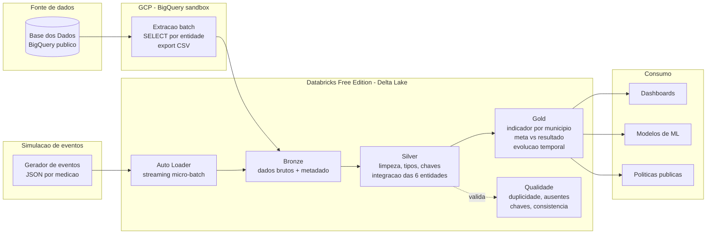

# Pipeline Híbrido para Análise da Alfabetização no Brasil

Tech Challenge Fase 2 | FIAP Pós Tech AI Scientist

Pipeline de dados que integra as fontes do Indicador Criança Alfabetizada, organiza tudo em Arquitetura Medalhão sobre Databricks e entrega uma camada analítica pronta para dashboard, estatística e machine learning. A ingestão é híbrida: batch para os dados históricos e streaming para atualizações de indicador em tempo quase real.

## Contexto do problema

Alfabetizar na idade certa é uma das apostas mais bem documentadas em política educacional. Quem não se alfabetiza até o fim do 2º ano do ensino fundamental carrega essa defasagem pelo resto da trajetória escolar, e o custo disso aparece lá na frente em evasão e em desigualdade de renda. O Compromisso Nacional Criança Alfabetizada é a política que junta União, estados, Distrito Federal e municípios em torno dessa meta, com o alvo de ter todas as crianças alfabetizadas até 2030.

Para medir isso de forma comparável, o Inep rodou em 2023 a Pesquisa Alfabetiza Brasil e definiu um ponto de corte de 743 pontos na escala de proficiência do Saeb. Criança acima desse corte é considerada alfabetizada. O percentual de crianças que atinge o corte é o Indicador Criança Alfabetizada, que é o dado central deste projeto.

O problema de dados é que esse indicador sozinho não explica muita coisa. Para entender por que um município vai bem e o vizinho não, é preciso cruzar o indicador com metas (nacional, estadual e municipal), com o território e com o perfil dos alunos. Essas fontes vêm separadas, com granularidades e chaves diferentes, e é aí que entra a engenharia de dados: integrar tudo de forma confiável e barata, para que a análise possa acontecer em cima de uma base única.

## O desafio educacional e o uso do indicador

A leitura do indicador não é trivial. Ele é uma proporção, então precisa ser comparado sempre contra a meta daquele recorte e daquele ano, nunca no valor absoluto. Um município com 70% de alfabetização pode estar indo muito bem ou muito mal, dependendo de onde ele partiu e de qual meta foi pactuada para ele. Por isso a camada analítica deste projeto não entrega só o indicador; ela entrega o indicador ao lado da meta e da série histórica, que é o que permite dizer se o município está fechando ou abrindo o gap para 2030.

## Arquitetura proposta

A solução roda em nuvem, com custo zero, combinando duas peças:

O GCP entra pelo BigQuery em modo sandbox, que dá acesso gratuito ao Base dos Dados (onde o Indicador Criança Alfabetizada está publicado como dataset público) dentro de um teto de 1 TB de consulta por mês, sem precisar de cartão. É onde acontece a extração batch.

O Databricks Free Edition, com compute Serverless, é o motor de processamento. É onde vivem as três camadas do medalhão em Delta Lake e onde roda tanto o batch quanto o streaming. Foi o ambiente usado nas aulas de Arquitetura de Big Data, então a escolha também respeita a stack do curso.



## Descrição da arquitetura da solução

A pipeline segue a Arquitetura Medalhão, com três camadas de responsabilidade bem separada.

A camada Bronze guarda o dado como ele chegou. Não limpo nem renomeio nada aqui; só acrescento metadado de ingestão (origem e timestamp), para conseguir auditar e reprocessar. É o histórico bruto, gravado em Delta.

A camada Silver é onde o dado vira confiável. Padronizo nomes de coluna para snake_case sem acento, forço os tipos corretos, normalizo as chaves de município (código IBGE de 7 dígitos, tratado como string por causa do zero à esquerda) e de UF, trato ausentes e duplicatas, e faço a integração das seis entidades num modelo único na granularidade município-ano. É a etapa que transforma seis tabelas soltas numa base coerente.

A camada Gold é o produto final. São três datasets: o indicador de alfabetização por município na medição mais recente, a comparação entre meta e resultado (com o gap para a meta), e a evolução temporal do indicador com variação ano a ano. Tudo particionado por ano e pronto para consumo.

## Fluxo de dados

O caminho batch começa no BigQuery. O script de extração roda uma query por entidade no sandbox, seleciona apenas as colunas necessárias e salva cada uma como CSV. Esses arquivos sobem para um Volume do Databricks. O notebook de Bronze lê os CSV e materializa as tabelas Delta brutas. O notebook de Silver lê a Bronze, aplica as transformações, integra as bases e grava a visão município-ano. O notebook de Gold lê a Silver e gera os três produtos analíticos.

O caminho streaming roda em paralelo. Um gerador escreve eventos JSON (novas medições de indicador) numa pasta monitorada. O Auto Loader consome esses arquivos em micro-batches e grava numa tabela de streaming na Bronze, com checkpoint para garantir que cada arquivo é processado uma vez só. Isso mostra que a mesma arquitetura absorve os dois modos de ingestão sem duplicar lógica.

Entre a Silver e a Gold roda o script de qualidade, que valida a base integrada e registra o resultado numa tabela de qualidade versionada.

## Tecnologias utilizadas e justificativa

BigQuery sandbox foi escolhido porque é onde o Base dos Dados já está e porque o modo sandbox é gratuito de verdade, sem cartão. Para uma fonte pública, não faz sentido montar ingestão própria quando o dado já está num warehouse consultável.

Databricks com PySpark e Delta Lake é o motor porque entrega Spark gerenciado, transações ACID, time travel e streaming no mesmo lugar, tudo no plano Free. Delta em cima de Parquet resolve de uma vez armazenamento colunar comprimido e confiabilidade transacional.

Auto Loader foi a escolha para streaming no lugar de Kafka. A justificativa está na seção de decisões abaixo.

Python puro com a biblioteca do BigQuery cobre a extração local, sem dependência de framework pesado para uma tarefa que é essencialmente rodar query e salvar arquivo.

## Decisões arquiteturais e trade-offs

Batch versus streaming. O grosso do dado é histórico e muda uma vez por ciclo de avaliação, então batch é o modo natural e mais barato. O streaming existe para o caso de atualização pontual de indicador, que é raro mas precisa ser absorvido rápido. Manter os dois lados evita o erro comum de tratar tudo como streaming (caro) ou tudo como batch (lento para o que é urgente).

Data lake versus data warehouse. Adotei lakehouse, que é o meio-termo. A Bronze e a Silver têm cara de lake (arquivo, schema flexível, histórico bruto). A Gold tem cara de warehouse (modelada, tipada, particionada, pronta para query). Delta Lake é justamente o que permite ter os dois comportamentos no mesmo storage sem exportar dado de um sistema para outro.

Custo versus performance. Em vários pontos escolhi o lado do custo, porque o volume não justifica gastar. Parquet e Delta para não pagar leitura desnecessária, particionamento por ano porque quase toda consulta filtra por ano, seleção de colunas na origem para ficar dentro do teto do sandbox, e o trigger `availableNow` no streaming para processar o que chegou e desligar, em vez de manter cluster ligado esperando evento.

Auto Loader no lugar de Kafka. Kafka foi o que estudamos em ETL Pipelines e resolveria o streaming, mas exige um broker de pé, o que é custo fixo e operação contínua. Para dado público de baixa volumetria, isso não se paga. O Auto Loader dá ingestão incremental com checkpoint e evolução de schema sem infra adicional. Se o cenário mudasse para muitos produtores em alto volume, aí Kafka voltaria para a mesa.

## Monitoramento e FinOps

Monitoramento. A observabilidade aqui se apoia em três coisas. O checkpoint do Auto Loader dá rastreabilidade do que já foi ingerido e detecta reprocessamento indevido. A tabela de qualidade guarda o resultado de cada execução das validações, então dá para acompanhar a saúde da base ao longo do tempo e disparar alerta quando um teste passa de ok para alerta. E os metadados de ingestão na Bronze permitem responder de onde e quando cada linha entrou, que é o primeiro dado que se procura quando algo falha. Num passo seguinte, esses sinais alimentariam um painel de falhas de ingestão, latência e volume processado.

FinOps. A arquitetura foi desenhada para custar o mínimo. As decisões que reduzem custo operacional: armazenamento em Parquet e Delta, que comprime e evita reprocessamento; particionamento por ano na Gold, que corta a varredura das queries; seleção de colunas já na extração do BigQuery, que mantém o consumo dentro do 1 TB gratuito do sandbox; compute Serverless sob demanda no Databricks Free, sem cluster ocioso; e o streaming em modo `availableNow`, que processa em rajada e para, em vez de manter processamento contínuo. Numa hipótese de migração para ambiente pago, o mesmo desenho seguiria barato, porque o gasto acompanharia o dado processado e não um cluster ligado o tempo todo.

## Aplicação em IA

A camada Gold já sai no formato que um projeto de IA precisa, uma linha por município e ano com indicador, meta, gap e tendência.

Para predição de alfabetização, dá para treinar um modelo que estima o indicador do próximo ciclo por município a partir do histórico e de variáveis de contexto, antecipando quais municípios tendem a ficar longe da meta de 2030. Enriquecendo a Gold com as fontes externas sugeridas no enunciado (Censo Escolar, dados socioeconômicos do IBGE, FUNDEB), o modelo ganha os fatores que de fato explicam o resultado.

Para análise de desigualdade, a mesma base permite clusterizar municípios por vulnerabilidade educacional e enxergar padrões regionais que o número nacional esconde.

Para política pública baseada em dados, o gap entre meta e resultado, cruzado com a previsão, vira uma fila de priorização: onde investir primeiro para maximizar o avanço rumo a 2030.

## Estrutura do repositório

```
.
├── README.md
├── requirements.txt
├── .gitignore
├── docs/
│   ├── arquitetura.md
│   ├── finops.md
│   ├── qualidade_dados.md
│   └── roteiro_video.md
├── src/
│   ├── ingestao/
│   │   ├── 00_extracao_bigquery.py       extrai as fontes do BigQuery
│   │   └── 91_gerador_eventos_streaming.py  simula eventos de indicador
│   ├── bronze/01_carga_bronze.py
│   ├── silver/02_carga_silver.py
│   ├── gold/03_carga_gold.py
│   ├── streaming/04_streaming_indicadores.py
│   └── qualidade/05_validacao_qualidade.py
├── data/sample/                          amostras pequenas para reprodutibilidade
└── diagrams/pipeline.mmd
```

## Fonte de dados

Dataset público no BigQuery: `basedosdados.br_inep_avaliacao_alfabetizacao`. As seis entidades do enunciado são as tabelas `uf`, `municipio`, `alunos`, `meta_alfabetizacao_brasil`, `meta_alfabetizacao_uf` e `meta_alfabetizacao_municipio`.

Duas decisões valem registro. O indicador já vem calculado na coluna `taxa_alfabetizacao` (nível município e UF), então a camada analítica usa esse valor direto em vez de derivar do corte de 743 pontos do Saeb sobre o microdado.

A coluna `rede` vem codificada nos indicadores (0 Total, 1 Federal, 2 Estadual, 3 Municipal, 4 Privada, 5 Pública Estadual e Municipal, 6 Pública Federal Estadual e Municipal) e como texto nas tabelas de meta. O filtro inicial usou `rede = 0` (Total), mas checando a distribuição real esse corte está praticamente vazio nos indicadores: 1 linha em toda a tabela `uf` e 398 município de cerca de 5.570 em `municipio`. A extração final usa `rede = 5` (Pública Estadual e Municipal) para `uf`, com cobertura de 25 das 27 UFs por ano, e `rede = 3` (Municipal) para `municipio`, com 5.448 município por ano (cerca de 98% do total). Essa escolha também bate com o que as próprias tabelas de meta usam: `meta_alfabetizacao_municipio` guarda a rede como texto `"Municipal"` e `meta_alfabetizacao_uf`/`meta_alfabetizacao_brasil` guardam `"Pública"` (código 6 nem aparece na base, então o correspondente é o 5). Com isso o indicador e a meta comparam a mesma rede, sem precisar de ressalva de comparabilidade. A tabela de alunos entra como amostra, para demonstrar ingestão de microdado sem processar milhões de linhas.

## Como reproduzir

Pré-requisitos: uma conta Google com BigQuery em modo sandbox e uma conta Databricks Free Edition. Nenhuma das duas pede cartão.

1. **Estrutura no Databricks.** Rode o notebook de setup para criar os schemas `alfabetizacao_bronze`, `alfabetizacao_silver` e `alfabetizacao_gold`, e o Volume `workspace.default.tech_challenge_fase2` com as subpastas `raw`, `streaming_in` e `_chk`.

2. **Extração batch.** Rode as seis consultas de `src/ingestao/consultas_bigquery.sql` no BigQuery sandbox (ou `src/ingestao/00_extracao_bigquery.py` localmente, com `gcloud auth application-default login` e `GCP_PROJECT` definido). Salve cada resultado como CSV com o nome exato esperado pela Bronze: `uf.csv`, `municipio.csv`, `alunos.csv`, `meta_uf.csv`, `meta_municipio.csv`, `meta_brasil.csv`. Antes de exportar, confira o contador de linhas na tela de resultados do BigQuery; ele pega às vezes só a amostra visível em vez do resultado completo.

3. **Upload.** Suba os seis CSVs para a subpasta `raw` do Volume, pelo Catalog Explorer (Volumes > `tech_challenge_fase2` > `raw` > Upload).

4. **Bronze.** Rode `src/bronze/01_carga_bronze.py`. Ele lê os CSVs como string, sem inferência de schema, grava em Delta e acrescenta `_arquivo_origem` e `_ingestao_ts`.

5. **Silver.** Rode `src/silver/02_carga_silver.py`. Tipa as colunas, deriva a UF a partir do código IBGE do município, despivota as metas (formato largo para longo) e integra o indicador municipal com a meta do ano correspondente.

6. **Gold.** Rode `src/gold/03_carga_gold.py`. Gera os três produtos analíticos (indicador por município, meta vs resultado, evolução temporal) e o resumo por UF, particionados por ano.

7. **Qualidade.** Rode `src/qualidade/05_validacao_qualidade.py`. Ele valida duplicidade, ausentes, chaves de relacionamento e consistência entre camadas, e grava o resultado numa tabela de qualidade.

8. **Streaming simulado.** Rode `src/ingestao/91_gerador_eventos_streaming.py` para gerar eventos JSON na pasta `streaming_in` do Volume, depois `src/streaming/04_streaming_indicadores.py`, que consome os eventos em micro-batches via Auto Loader e grava na Bronze de streaming, com checkpoint em `_chk`.

## Vídeo executivo

[Assista no Loom](https://www.loom.com/share/f899661f78cf4c8a88e898671f626f0f)

## Checklist final antes da entrega

- [x] Base dos Dados usado como fonte, via BigQuery.
- [x] Camadas Bronze, Silver e Gold implementadas, com integração na Silver.
- [x] Ingestão batch e streaming (simulado) presentes e validadas (50 eventos consumidos via Auto Loader).
- [x] Scripts de qualidade de dados rodando e documentados (6 checagens, 0 alertas).
- [x] Solução em nuvem (GCP BigQuery + Databricks Free Edition).
- [x] README completo com diagrama, fluxo, trade-offs, FinOps e aplicação em IA.
- [x] Git com histórico de commits, branches por funcionalidade e seis PRs mergeadas na main.
- [x] Vídeo executivo gravado e link acima.
- [ ] Repositório público e link enviado na plataforma FIAP.